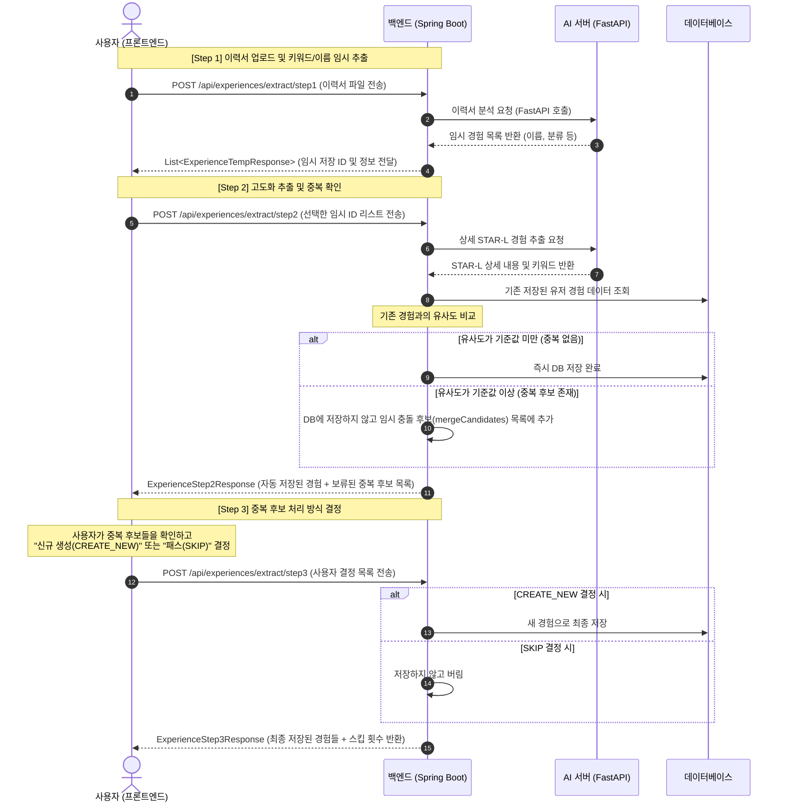

# Pickd 백엔드 API 국문 명세서 (노션 복사용)

이 문서는 프론트엔드 연동을 위해 모든 API 엔드포인트와 요청/응답 필드를 한국어로 번역 및 정리한 문서입니다. 마크다운 형식을 지원하므로 노션(Notion)에 그대로 복사(Ctrl+C)하여 붙여넣기(Ctrl+V)하시면 깔끔하게 표로 변환됩니다.

---

## 🔄 경험 추출 3단계 신규 흐름 개요 (STAR-L 경험 추출 및 중복 처리)

최근 병합된 경험 추출 프로세스의 전체 흐름도와 단계별 스펙입니다.

---

## 1. 경험 추출 및 관리 API (Experiences)

### [Step 1] 파일 기반 임시 경험 항목 일차 추출
* **엔드포인트**: `POST /api/experiences/extract/step1`
* **설명**: 사용자가 업로드한 이력서/포트폴리오 파일에서 AI가 경험 후보 목록(임시 ID)을 일차적으로 추출합니다.
* **요청 (Multipart Form-Data)**:
  | 필드명 | 타입 | 필수 여부 | 설명 | 예시값 |
  | :--- | :--- | :---: | :--- | :--- |
  | file | MultipartFile | 필수 | 이력서/경력 서류 파일 | `resume.pdf` |

* **응답 Body (`List<ExperienceTempResponse>`)**:
  | 필드명 | 타입 | 설명 | 예시값 |
  | :--- | :--- | :--- | :--- |
  | id | Long | 임시 경험 ID (Step 2 요청 시 사용) | `45` |
  | userId | Long | 사용자 고유 ID | `12` |
  | experienceName | String | 추출된 경험명 (예: 동아리 프로젝트 등) | `Apptive 24기 안드로이드 토이 프로젝트` |
  | experienceGroup | String | 경험 대분류 | `NARRATIVE` (수기형) |
  | experienceType | String | 경험 세부 유형 | `PROJECT` (프로젝트) |
  | createdAt | String (ISO) | 생성 시간 | `2026-06-03T10:00:00` |

---

### [Step 2] 선택한 경험 고도화 추출 & 중복 비교
* **엔드포인트**: `POST /api/experiences/extract/step2`
* **설명**: Step 1에서 받은 임시 ID 중 사용자가 선택한 건에 대해 STAR-L 상세 구조로 추출하고, 기존 경험들과 비교하여 중복 여부를 가려냅니다.
* **요청 Body**:
  | 필드명 | 타입 | 필수 여부 | 설명 | 예시값 |
  | :--- | :--- | :---: | :--- | :--- |
  | selectedTempIds | List\<Long\> | 필수 | 사용자가 고도화 대상으로 지정한 임시 경험 ID 리스트 | `[45, 46]` |

* **응답 Body (`ExperienceStep2Response`)**:
  * **1) `savedExperiences`**: 즉시 자동 저장 완료된 경험 목록 (`List<UserExperienceResponse>`)
  * **2) `mergeCandidates`**: 기존 경험과 유사도가 높아 보류된 중복 후보 목록 (`List<ExperienceMergeConflictResponse>`)
    | 필드명 | 타입 | 설명 | 예시값 |
    | :--- | :--- | :--- | :--- |
    | needsMerge | boolean | 중복 처리 필요 여부 (항상 `true`) | `true` |
    | similarity | Double | 기존 저장된 데이터와의 유사도 비율 (0.0 ~ 1.0) | `0.87` |
    | **candidate** | Object | **기존 DB에 이미 저장되어 있는 유사 경험 정보** | 아래 candidate 객체 구조 참조 |
    | **draft** | Object | **이번에 AI가 새로 추출해낸 유사 경험 초안(Draft)** | 아래 draft 객체 구조 참조 |

  * **`candidate` 객체 구조 (기존 저장 경험)**
    | 필드명 | 타입 | 설명 | 예시값 |
    | :--- | :--- | :--- | :--- |
    | id | String (UUID) | 기존 경험의 DB 고유 ID | `exp_7f8a9b2c...` |
    | title | String | 기존 경험의 제목 | `앱티브 연합 동아리 안드로이드 개발` |
    | experienceType | String | 경험 유형 | `PROJECT` |
    | experienceGroup | String | 경험 대분류 | `NARRATIVE` |
    | similarity | Double | 유사도 | `0.87` |

  * **`draft` 객체 구조 (새로 분석된 임시 초안)**
    | 필드명 | 타입 | 설명 | 예시값 |
    | :--- | :--- | :--- | :--- |
    | title | String | 신규 경험 제목 | `Apptive 24기 안드로이드 토이 프로젝트` |
    | experienceType | String | 경험 유형 | `PROJECT` |
    | experienceGroup | String | 경험 대분류 | `NARRATIVE` |
    | status | String | 진행 상태 | `COMPLETED` |
    | documentContent | String | AI가 추출한 STAR-L 상세 본문 | `[S] ... [T] ... [A] ... [R] ... [L] ...` |
    | attributes | Map | 세부 요약 속성 데이터 (JSON) | `{"role": "팀원", "period": "3개월"}` |
    | keywords | List\<String\> | AI가 뽑아낸 핵심 키워드 목록 | `["Android", "API 연동", "앱개발"]` |

---

### [Step 3] 중복 후보 처리 최종 결정
* **엔드포인트**: `POST /api/experiences/extract/step3`
* **설명**: 프론트엔드 화면에서 유저에게 중복 후보(`candidate` vs `draft`)를 보여준 뒤, 유저가 내린 결정(새로 저장할 것인지, 스킵할 것인지)을 반영하여 최종 처리합니다.
* **요청 Body (`ExperienceStep3Request`)**:
  * **`decisions`** (List): 사용자 결정 목록
    | 필드명 | 타입 | 필수 여부 | 설명 | 예시값 |
    | :--- | :--- | :---: | :--- | :--- |
    | action | String (Enum) | 필수 | 이 중복 후보의 최종 처리 방식. `CREATE_NEW` (중복 무시하고 신규 저장) `SKIP` (기존 것 유지하고 새 데이터 버림) | `CREATE_NEW` |
    | draft | Object | 필수 | 사용자가 최종 결정한 대상 경험 초안 정보 | `ExperienceDraftRequest` (Step 2 응답의 `draft`와 동일한 양식) |

* **응답 Body (`ExperienceStep3Response`)**:
  | 필드명 | 타입 | 설명 | 예시값 |
  | :--- | :--- | :--- | :--- |
  | savedExperiences | List | `CREATE_NEW`로 선택하여 최종 신규 저장 완료된 경험 리스트 | `[UserExperienceResponse 객체들]` |
  | skippedCount | int | `SKIP`을 선택하여 최종적으로 저장을 패스(버림)한 경험 개수 | `1` |

---

### 수동 경험 수기 작성 및 생성
* **엔드포인트**: `POST /api/experiences`
* **설명**: 사용자가 UI 폼을 입력해서 직접 경험 카드를 등록할 때 호출합니다.
* **요청 Body (`ExperienceCreateRequestDto`)**:
  | 필드명 | 타입 | 필수 여부 | 설명 | 예시값 |
  | :--- | :--- | :---: | :--- | :--- |
  | title | String | 필수 | 경험 카드 제목 | `2025 해커톤 최우수상 수상` |
  | experienceType | String (Enum) | 필수 | 경험 유형 | `CONTEST` |
  | experienceGroup | String (Enum) | 필수 | 경험 분류 (`NARRATIVE`: 수기형, `SPEC`: 스펙형) | `NARRATIVE` |
  | status | String (Enum) | 필수 | 상태 (`IN_PROGRESS`: 준비중, `COMPLETED`: 완료) | `COMPLETED` |
  | documentContent | String | 선택 | 경험 상세 설명 (STAR-L 본문 등) | `S: 해커톤에 참가함 ...` |
  | attributes | Map | 선택 | 속성값 맵 | `{"teamName": "앱티브", "role": "PM"}` |
  | keywords | List\<String\> | 선택 | 핵심 키워드 리스트 | `["React", "AWS"]` |
  | links | List | 선택 | 참고 링크 리스트 | 아래 links 구조 참조 |

  * **`links` 내부 객체 구조**
    | 필드명 | 타입 | 설명 | 예시값 |
    | :--- | :--- | :--- | :--- |
    | title | String | 링크 제목 | `깃허브 리포지토리` |
    | url | String | 이동 주소 URL | `https://github.com/example/repo` |
    | materialType | String | 참고 문서 유형 | `GITHUB` |
    | documentPosition| Integer | 본문 내 참조 위치 인덱스 | `150` |

---

### [공통 리턴 양식] UserExperienceResponse 필드 정보
경험 상세 조회(`GET /api/experiences/{id}`) 및 목록 조회(`GET /api/experiences`) 시 반환되는 표준 공통 JSON 규격입니다.

| 필드명 | 타입 | 설명 | 예시값 |
| :--- | :--- | :--- | :--- |
| id | String (UUID) | DB 저장 고유 경험 카드 ID | `exp_9a8b7c6d...` |
| userId | Long | 사용자 번호 | `12` |
| title | String | 경험 제목 | `2025 해커톤 최우수상 수상` |
| experienceType | String | 경험 유형 | `CONTEST` |
| experienceGroup | String | 경험 대분류 | `NARRATIVE` |
| status | String | 진행 여부 | `COMPLETED` |
| documentContent | String | 경험 내용 본문 | `S: 해커톤에 참가함...` |
| attributes | Map | 추가 속성값 | `{"role": "FrontEnd"}` |
| keywords | List\<String\> | 추출/입력된 키워드 배열 | `["React", "AWS"]` |
| files | List\<Object\> | 첨부된 증빙 파일 목록 (id, 오리지널 파일명, 파일경로(CDN) 등 포함) | `[]` |
| links | List\<Object\> | 첨부된 외부 주소 링크 목록 | `[]` |
| createdAt | String (ISO) | 생성 일시 | `2026-06-03T10:00:00+09:00` |
| updatedAt | String (ISO) | 최근 수정 일시 | `2026-06-03T11:30:00+09:00` |

---

## 2. 사용자 및 온보딩 API (User & Onboarding)

### 온보딩 정보 등록 및 전체 업데이트
* **엔드포인트**: `POST /api/onboarding`
* **설명**: 회원가입 직후 혹은 프로필 관리에서 온보딩의 모든 항목을 일시에 갱신합니다.
* **요청 Body (`OnboardingRequest`)**:
  - *상세 필드 목록은 이전 명세의 [OnboardingRequest] 항목과 동일합니다. (약관동의, 본인인증, 거주지, 대학교, 관심직무, 준비현황 포함)*

* **응답 Body (`UserResponseDto`) / 온보딩 상태 조회 (`GET /api/onboarding/status`) 응답**:
  | 필드명 | 타입 | 설명 | 예시값 |
  | :--- | :--- | :--- | :--- |
  | email | String | 로그인된 유저 이메일 | `user@gmail.com` |
  | name | String | 실명 | `김민수` |
  | nickname | String | 닉네임 | `취준러A` |
  | picture | String | 구글 프로필 이미지 URL | `https://lh3.googleusercontent.com/...` |
  | onboardingStep | String (Enum) | 현재 유저의 온보딩 진행 단계 (`COMPLETED`면 완성) | `COMPLETED` |
  | currentResidence | String | 거주 지역 | `부산광역시` |
  | schoolName | String | 학교명 | `부산대학교` |
  | major | String | 학과명 | `정보컴퓨터공학부` |
  | targetPeriod | String | 취업 목표 시기 | `2026 하반기` |

### 온보딩 진행 상태 조회
* **엔드포인트**: `GET /api/onboarding/status`
* **설명**: 현재 유저의 온보딩 진행 단계를 조회합니다.
* **응답 Body**: `UserResponseDto` (위의 온보딩 정보 등록 응답 규격과 동일)

### 온보딩 정보 초기화 (테스트용)
* **엔드포인트**: `POST /api/onboarding/reset`
* **설명**: 현재 유저의 온보딩 단계를 초기화(`NONE`)하고 작성된 데이터를 리셋합니다.
* **응답 Body (Plain Text)**:
  - `"Reset complete"`

---

## 3. 채용 공고 관리 API (Notice - JD 분석)

### URL 기반 채용공고 AI 분석 및 저장
* **엔드포인트**: `POST /api/notices/analyze/url`
* **요청 Body (`UrlAnalysisRequestDto`)**:
  | 필드명 | 타입 | 필수 여부 | 설명 | 예시값 |
  | :--- | :--- | :---: | :--- | :--- |
  | url | String | 필수 | 분석할 채용공고의 웹 주소 URL | `https://career.kakao.com/jobs/1234` |

* **응답 Body**:
  | 필드명 | 타입 | 설명 | 예시값 |
  | :--- | :--- | :--- | :--- |
  | noticeId | Long | 생성된 채용공고 DB 고유 ID | `102` |

### PDF 파일 기반 채용공고 AI 분석 및 저장
* **엔드포인트**: `POST /api/notices/analyze/pdf`
* **설명**: 사용자가 업로드한 공고 PDF 파일에서 AI가 정보를 분석하여 저장합니다.
* **요청 (Multipart Form-Data)**:
  | 필드명 | 타입 | 필수 여부 | 설명 | 예시값 |
  | :--- | :--- | :---: | :--- | :--- |
  | file | MultipartFile | 필수 | 분석용 채용공고 PDF 파일 | `kakao_job.pdf` |

* **응답 Body**:
  | 필드명 | 타입 | 설명 | 예시값 |
  | :--- | :--- | :--- | :--- |
  | noticeId | Long | 생성된 채용공고 DB 고유 ID | `103` |

---

## 4. 지원 현황 관리 API (Application - CRUD 전체)

### 지원 현황 전체 목록 조회
* **엔드포인트**: `GET /api/application`
* **설명**: 현재 사용자의 입사 지원 현황 전체를 조회합니다. (최근 등록 순 정렬)
* **응답 Body (`List<Application>`)**:
  | 필드명 | 타입 | 설명 | 예시값 |
  | :--- | :--- | :--- | :--- |
  | id | Long | 지원서의 DB 고유 번호 | `4` |
  | company | String | 지원 회사명 | `토스` |
  | jobTitle | String | 채용 공고명 | `2026 백엔드 개발자 공개채용` |
  | position | String | 지원 직무 / 포지션 | `Backend Engineer` |
  | industry | String | 산업군 분야 | `핀테크` |
  | status | String | 현재 전형 상태 | `서류제출 완료` |
  | memo | String | 간단한 메모 내용 | `코딩테스트 일정 확인 요망` |
  | applyDate | String (ISO) | 지원한 날짜 및 시간 | `2026-06-03T14:00:00` |
  | deadlineDate | String (ISO) | 공고 마감 날짜 및 시간 | `2026-06-20T18:00:00` |

### 지원 현황 추가
* **엔드포인트**: `POST /api/application`
* **요청 Body (`ApplicationRequest`)**:
  | 필드명 | 타입 | 필수 여부 | 설명 | 예시값 |
  | :--- | :--- | :---: | :--- | :--- |
  | company | String | 선택 | 지원 회사명 | `토스` |
  | jobTitle | String | 선택 | 채용 공고명 | `2026 백엔드 개발자 공개채용` |
  | position | String | 선택 | 지원 직무 | `Backend Engineer` |
  | industry | String | 선택 | 산업군 | `핀테크` |
  | status | String | 선택 | 전형 진행 단계 | `서류제출 완료` |
  | memo | String | 선택 | 간단한 메모 | `1차 코딩테스트 준비` |
  | applyDate | String (ISO) | 선택 | 지원 일시 | `2026-06-03T14:00:00` |
  | deadlineDate | String (ISO) | 선택 | 마감 일시 | `2026-06-20T18:00:00` |

* **응답 Body**: 없음 (HTTP 200 OK)

### 지원 현황 수정
* **엔드포인트**: `PUT /api/application/{id}`
* **설명**: 기존 입사 지원 정보를 수정합니다.
* **요청 경로 변수**:
  * `id` (Long): 수정할 지원서 ID
* **요청 Body (`ApplicationRequest`)**: 등록 시와 동일 (수정 내용 전송)
* **응답 Body**: 없음 (HTTP 200 OK)

### 지원 현황 삭제
* **엔드포인트**: `DELETE /api/application/{id}`
* **설명**: 기존 입사 지원 정보를 삭제합니다.
* **요청 경로 변수**:
  * `id` (Long): 삭제할 지원서 ID
* **응답 Body**: 없음 (HTTP 200 OK)

---

## 5. 구글 캘린더 연동 API (Calendar - CRUD 전체)

### 캘린더 일정 목록 조회
* **엔드포인트**: `GET /api/calendar/events`
* **설명**: 현재 로그인한 사용자의 구글 캘린더 일정을 가져옵니다.
* **요청 쿼리 파라미터 (선택)**:
  | 필드명 | 타입 | 설명 | 기본값 |
  | :--- | :--- | :--- | :--- |
  | timeMin | String (ISO) | 일정 조회 시작 날짜/시간 | 현재 기준 1년 전 |
  | timeMax | String (ISO) | 일정 조회 마감 날짜/시간 | 현재 기준 2년 후 |

* **응답 Body**:
  - `List<Event>` (구글 캘린더 API 표준 Event 객체 리스트 반환)

### 캘린더 일정 등록
* **엔드포인트**: `POST /api/calendar/events`
* **요청 Body (`CalendarEventRequest`)**:
  | 필드명 | 타입 | 필수 여부 | 설명 | 예시값 |
  | :--- | :--- | :---: | :--- | :--- |
  | summary | String | 필수 | 일정 제목 | `네이버 면접 준비` |
  | location | String | 선택 | 일정 장소 | `그린팩토리 15층` |
  | description | String | 선택 | 상세 설명 메모 | `사전 준비 자료 인쇄해가기` |
  | start | Object | 필수 | 시작 날짜 및 시간 (dateTime, timeZone 포함) | `{"dateTime": "2026-06-10T14:00:00+09:00", "timeZone": "Asia/Seoul"}` |
  | end | Object | 필수 | 종료 날짜 및 시간 (dateTime, timeZone 포함) | `{"dateTime": "2026-06-10T15:00:00+09:00", "timeZone": "Asia/Seoul"}` |

* **응답 Body**: 등록된 구글 `Event` 객체

### 캘린더 일정 수정 (부분 업데이트 지원)
* **엔드포인트**: `PUT /api/calendar/events/{eventId}`
* **설명**: 기존 등록된 구글 일정을 수정합니다.
* **요청 경로 변수**:
  * `eventId` (String): 구글 캘린더 이벤트 ID
* **요청 Body (`CalendarEventRequest`)**: 수정하려는 필드만 채워 전송 가능
* **응답 Body**: 수정 완료된 구글 `Event` 객체

### 캘린더 일정 삭제
* **엔드포인트**: `DELETE /api/calendar/events/{eventId}`
* **요청 경로 변수**:
  * `eventId` (String): 삭제할 구글 캘린더 이벤트 ID
* **응답 Body**: 없음 (HTTP 200 OK)

### 캘린더 연동 사용자 본인 확인용
* **엔드포인트**: `GET /api/calendar/me`
* **응답 Body (Plain Text)**: 현재 연동된 사용자의 구글 이메일 문자열

---

## 6. S3 파일 업로드 API (File)

### S3 파일 업로드
* **엔드포인트**: `POST /api/files/upload`
* **설명**: 증빙 서류나 이력서를 서버 저장소(S3)에 적재하고 인터넷으로 접근 가능한 링크를 받습니다.
* **요청 (Multipart Form-Data)**:
  | 필드명 | 타입 | 필수 여부 | 설명 | 예시값 |
  | :--- | :--- | :---: | :--- | :--- |
  | file | MultipartFile | 필수 | 업로드 대상 파일 객체 | `my_license.png` |
  | type | String (Enum) | 필수 | 업로드 종류 (`LICENSE`, `EDUCATION`, `LANGUAGE`, `AWARD`, `TEMP_RESUME`, `GENERAL`) | `LICENSE` |

* **응답 Body**:
  | 필드명 | 타입 | 설명 | 예시값 |
  | :--- | :--- | :--- | :--- |
  | fileUrl | String | S3 업로드 완료 후 생성된 외부 접근용 CDN URL | `https://cdn.pickd.co.kr/experience/license/12/abcde_my_license.png` |
  | fileName | String | 업로드된 오리지널 파일명 | `my_license.png` |
  | uploadType | String | 지정한 업로드 분류명 | `LICENSE` |
